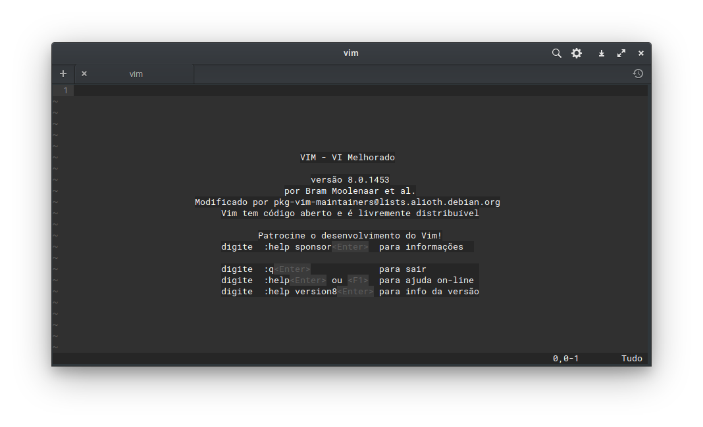
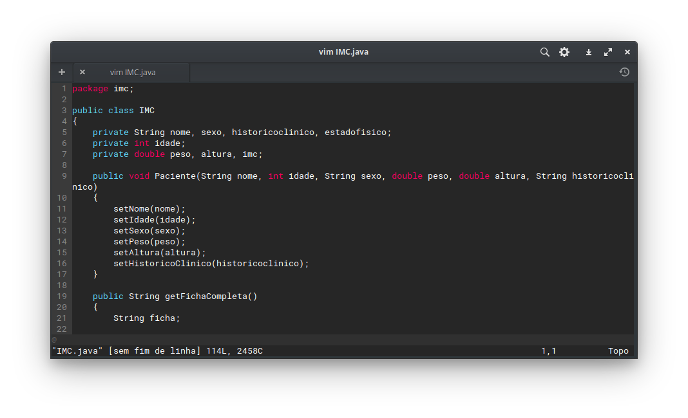

# vimrc

Meu arquivo de configuração do VIM, vimrc.

## Uso

Baixe este repositorio e siga um dos modos a seguir para a instalação.

#### Automatico

Baixe este repositorio e rode o arquivo install.sh com:\
$ bash install.sh

#### Manual

Copie o arquivo ou sobreescreva movendo para o caminho do seu vimrc localizado em:\
*~/.vimrc*\
$ sudo mv vimrc ~/.vimrc\
$ git clone https://github.com/sickill/vim-monokai\
$ cd vim-monokai\
$ cd colors\
$ sudo mv monokai.vim /usr/share/vim/vim80/colors/

## Creditos

VIM-Monokai:

https://github.com/sickill/vim-monokai
