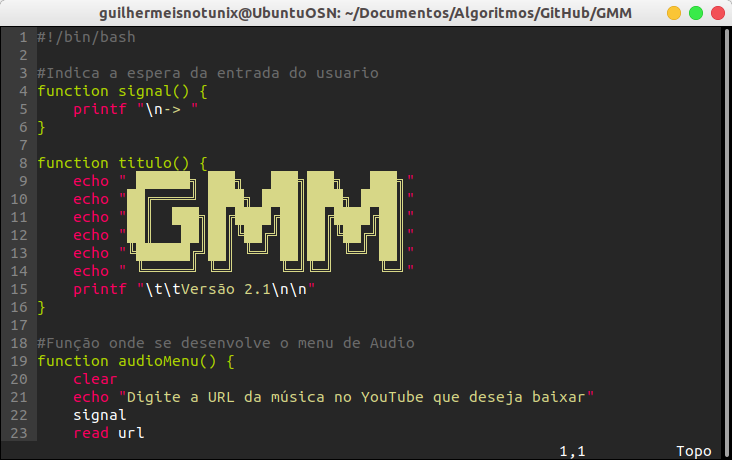

# vimrc

Meu arquivo de configuração do VIM, vimrc.

## Uso

Baixe o arquivo vimrc deste repositorio\
Copie o conteúdo dele ou sobreescreva movendo para o caminho do seu vimrc localizado em:\
*~/.vimrc*

## Creditos

VIM-Monokai:

https://github.com/sickill/vim-monokai
